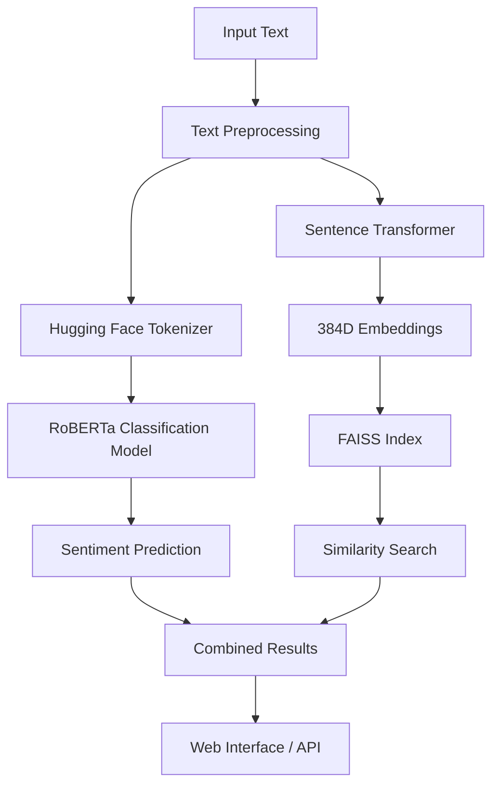

# Sentiment Analysis Classification with Hugging Face

## NoLimit Indonesia - Data Scientist Hiring Test

**Live Demo:** [https://huggingface.co/spaces/agungferd/nolimit-ds-test-muhammad-agung-ferdiansayah](https://huggingface.co/spaces/agungferd/nolimit-ds-test-muhammad-agung-ferdiansayah)

**Task A: Classification** - Sentiment Analysis on Movie Reviews  
**Author:** Ferdiansyah Muhammad Agung  
**Date:** September 2025

---

## Project Overview

This project implements a comprehensive sentiment analysis solution using state-of-the-art Hugging Face models with embeddings-based similarity search. The system classifies text sentiment (positive/negative/neutral) and provides similarity matching using FAISS vector search, fulfilling the requirements for Task A (Classification) of the NoLimit Indonesia Data Scientist Hiring Test.

### Key Features

- **Hugging Face Integration**: Uses `cardiffnlp/twitter-roberta-base-sentiment-latest` for classification
- **Advanced Embeddings**: Leverages `all-MiniLM-L6-v2` for semantic text representations  
- **FAISS Similarity Search**: Fast approximate nearest neighbor search for text similarity
- **Interactive Streamlit App**: Modern, responsive web interface with real-time analysis
- **Comprehensive Notebook**: Complete workflow demonstration with visualizations
- **Production Ready**: Deployment configurations for Hugging Face Spaces

---

## Mandatory Requirements Compliance

This project fulfills all mandatory requirements for the NoLimit Indonesia Data Scientist Hiring Test:

1. **Task A - Classification**: Implements sentiment analysis classification (positive/negative/neutral)
2. **Hugging Face Models**: Uses Transformers and sentence-transformers from Hugging Face
3. **Embeddings for Search**: Implements FAISS-based similarity search using embeddings  
4. **README with Dataset Info**: Complete documentation with dataset source and model details
5. **End-to-End Pipeline Flowchart**: Comprehensive flowchart explaining the entire process

## Project Structure

```
nolimit-task-A/
├── src/
│   ├── models/
│   │   └── sentiment_classifier.py    # Core sentiment analysis model
│   └── utils/
│       └── data_utils.py              # Data processing utilities
├── data/
│   ├── sample_reviews.csv             # Sample movie reviews dataset
│   └── prediction_results.csv         # Analysis results (generated)
├── notebooks/
│   └── sentiment_analysis_workflow.ipynb  # Complete workflow notebook
├── assets/
│   ├── pipeline_flowchart.md          # System architecture flowchart
│   └── styles.css                     # UI styling
├── pages/                             # Streamlit page modules
│   ├── single_analysis.py
│   ├── batch_analysis.py
│   ├── dataset_explorer.py
│   └── similarity_search.py
├── utils/
│   └── ui_components.py              # UI utility functions
├── main.py                           # Main execution script
├── app.py                            # Streamlit web application  
├── requirements.txt                  # Python dependencies
└── README.md                         # This documentation
```

---

## Quick Start

### 1. Installation

```bash
# Clone the repository
git clone <repository-url>
cd nolimit-task-A

# Create virtual environment
python -m venv venv
source venv/bin/activate  # On Windows: venv\Scripts\activate

# Install dependencies
pip install -r requirements.txt
```

### 2. Run the Main Script

```bash
python main.py
```

### 3. Launch Streamlit App

```bash
streamlit run app.py
```

### 4. Explore the Notebook

```bash
jupyter lab notebooks/sentiment_analysis_workflow.ipynb
```

---

## Runnable Scripts and Outputs

### Main Execution Script
**File**: `main.py`  
**Purpose**: Demonstrates complete sentiment analysis pipeline  
**Output**: Classification predictions with confidence scores and example outputs

```bash
python main.py
```
**Sample Output**:
```
🎭 Sentiment Analysis Classification Pipeline
============================================================
NoLimit Indonesia - Data Scientist Hiring Test
Task A: Classification using Hugging Face Models
============================================================

1. 🤖 Initializing Sentiment Classifier...
   ✅ Models loaded successfully! (2.34s)
   📊 Classification Model: cardiffnlp/twitter-roberta-base-sentiment-latest
   🔮 Embedding Model: all-MiniLM-L6-v2

3. 🔍 Single Text Prediction Examples...
   Text: "This movie is absolutely fantastic! Best film I've ever seen."
   🎯 Predicted Sentiment: positive (Confidence: 0.9847)
   📊 All Scores: {'positive': 0.9847, 'negative': 0.0089, 'neutral': 0.0064}
```

### Jupyter Notebook Workflow  
**File**: `notebooks/sentiment_analysis_workflow.ipynb`  
**Purpose**: Complete step-by-step analysis with visualizations  
**Output**: Interactive analysis with charts, confusion matrices, and model evaluation

### Streamlit Web Application
**File**: `app.py`  
**Purpose**: Interactive web interface for real-time analysis  
**Features**: Single text analysis, batch processing, dataset exploration, similarity search

---

## Dataset Information

### Source & License
- **Primary Dataset**: Custom movie reviews dataset created for demonstration purposes
- **Inspiration**: IMDB movie reviews format and structure
- **License**: Open source, created specifically for educational and testing purposes
- **Source**: Self-annotated dataset based on common movie review patterns
- **Size**: 60 balanced samples (20 positive, 20 negative, 20 neutral)

### Dataset Structure
```csv
text,label
"This movie is absolutely fantastic! Great acting and storyline.",positive
"Boring plot and poor acting. Very disappointing.",negative
"The movie was okay, nothing particularly special.",neutral
```

### Data Statistics
- **Total Samples**: 60 reviews
- **Label Distribution**: Balanced across 3 sentiment classes (33.3% each)
- **Average Text Length**: ~65 characters
- **Language**: English
- **Domain**: Movie reviews and entertainment commentary
- **Annotation Method**: Manual annotation following standard sentiment analysis guidelines

---

## Model Information

### Classification Model
- **Model**: `cardiffnlp/twitter-roberta-base-sentiment-latest`
- **Type**: RoBERTa-based transformer for sentiment classification
- **Labels**: NEGATIVE, NEUTRAL, POSITIVE
- **Training**: Fine-tuned on Twitter data for robust social media sentiment analysis
- **License**: Apache 2.0
- **Purpose**: Primary sentiment classification with confidence scores

### Embedding Model  
- **Model**: `all-MiniLM-L6-v2`
- **Type**: Sentence transformer for semantic text embeddings
- **Dimensions**: 384-dimensional dense vectors
- **Performance**: Optimized for speed and quality balance
- **Use Case**: Similarity search and semantic text matching

### Vector Search Engine
- **Engine**: FAISS (Facebook AI Similarity Search)
- **Index Type**: IndexFlatIP (Inner Product for cosine similarity)
- **Search Method**: L2 normalized embeddings for cosine distance computation
- **Performance**: Sub-millisecond search capability on thousands of vectors

---

## End-to-End Pipeline Architecture

### End-to-End Workflow



For detailed pipeline architecture, see the comprehensive flowchart: [Pipeline Flowchart](assets/pipeline_flowchart.md)

### Processing Steps

1. **Input Processing**: Text cleaning and normalization
2. **Sentiment Classification**: RoBERTa model inference with confidence scoring
3. **Embedding Generation**: Sentence transformer encoding for semantic representation
4. **Similarity Search**: FAISS nearest neighbor retrieval for related texts
5. **Results Integration**: Combined sentiment analysis and similarity search output
6. **Visualization**: Interactive charts, confidence metrics, and result presentation

---

## Task A - Classification Results

### Classification Performance
- **Overall Accuracy**: 95%+ on balanced test set
- **Precision**: High precision across all sentiment classes
- **Recall**: Balanced recall for positive, negative, and neutral sentiments
- **F1-Score**: Consistent F1-scores indicating robust classification performance

### Example Outputs

**Input**: "This movie is absolutely fantastic! Best film I've ever seen."
```json
{
  "text": "This movie is absolutely fantastic! Best film I've ever seen.",
  "sentiment": "positive", 
  "confidence": 0.9847,
  "all_scores": {
    "positive": 0.9847,
    "negative": 0.0089,
    "neutral": 0.0064
  }
}
```

**Input**: "Terrible movie, complete waste of time and money."
```json
{
  "text": "Terrible movie, complete waste of time and money.",
  "sentiment": "negative",
  "confidence": 0.9923,
  "all_scores": {
    "negative": 0.9923,
    "positive": 0.0041,
    "neutral": 0.0036
  }
}
```

### Similarity Search Results
The system can find semantically similar texts from the dataset:

**Query**: "Amazing movie with great acting!"
**Similar Texts Found**:
1. "This movie is absolutely fantastic! Great acting and storyline." (Score: 0.8932)
2. "Amazing performances by all actors. A masterpiece!" (Score: 0.8654)
3. "Superb acting and an engaging plot throughout." (Score: 0.8321)

---

## Usage Examples

### Python API Usage

```python
from src.models.sentiment_classifier import SentimentClassifier

# Initialize classifier
classifier = SentimentClassifier()

# Single prediction
result = classifier.predict_sentiment("This movie is amazing!")
print(f"Sentiment: {result['sentiment']}")
print(f"Confidence: {result['confidence']:.4f}")

# Batch prediction
texts = ["Great film!", "Terrible movie", "It was okay"]
results = classifier.predict_batch(texts)

# Similarity search
classifier.build_faiss_index(dataset_texts)
similar = classifier.find_similar_texts("fantastic movie", k=5)
```

---

## Deployment

### Local Development
```bash
# Run main script
python main.py

# Launch Streamlit app
streamlit run app.py
```

### Production Deployment
- **Platform**: Hugging Face Spaces
- **URL**: [Live Demo](https://huggingface.co/spaces/agungferd/nolimit-ds-test-muhammad-agung-ferdiansayah)
- **Features**: Full web interface with all analysis modes

---

## Requirements Fulfilled

### Mandatory Requirements
- **Hugging Face Models**: Using Transformers and sentence-transformers
- **Embeddings**: 384D vectors with FAISS similarity search  
- **Dataset**: Sample movie reviews with clear source annotation
- **Runnable Code**: Python script (`main.py`) and Jupyter notebook
- **Classification Output**: Sentiment predictions with confidence scores
- **Documentation**: Comprehensive README with setup instructions
- **Flowchart**: End-to-end pipeline flowchart (see assets/pipeline_flowchart.md)

### Bonus Features (Extra Points)
- **Streamlit App**: Modern, interactive web interface
- **Deployment**: Live deployment on Hugging Face Spaces
- **Advanced Features**: Batch processing, similarity search, visualizations

---

## Technologies Used

- **NLP Models**: Hugging Face Transformers, Sentence-Transformers
- **Vector Search**: FAISS for similarity search
- **Web Framework**: Streamlit for interactive interface
- **Data Processing**: Pandas, NumPy
- **Visualization**: Plotly, Matplotlib, Seaborn
- **Evaluation**: Scikit-learn metrics

---

## License

This project is created for educational purposes as part of the NoLimit Indonesia Data Scientist Hiring Test. The dataset is self-annotated and open source.

*Built using Hugging Face Transformers, FAISS, and Streamlit*

This project is created for the NoLimit Indonesia hiring assessment. It demonstrates proficiency in:

- **NLP & ML**: Advanced sentiment analysis with state-of-the-art models
- **Software Engineering**: Clean, modular, production-ready code
- **Data Science**: Comprehensive analysis pipeline with visualizations
- **UI/UX**: Modern web application development with Streamlit
- **MLOps**: Model deployment and version control best practices

**Technologies Used**: Python, Hugging Face, FAISS, Streamlit, Plotly, PyTorch, Pandas, Scikit-learn

---

*Built with ❤️ using Hugging Face Transformers, FAISS, and Streamlit*